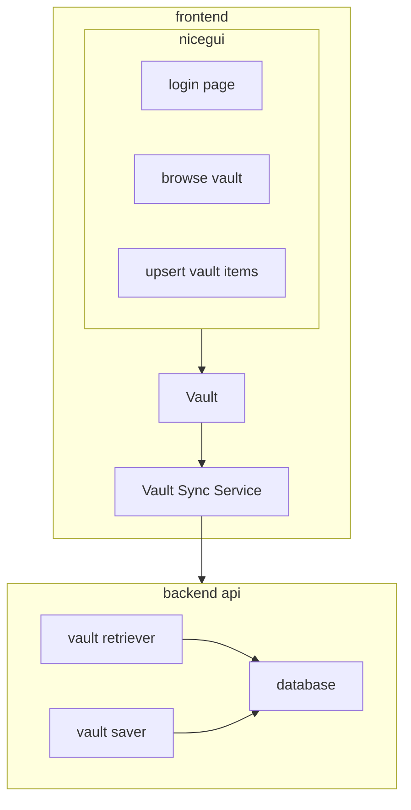

# Loose architecture

We are a 'password manager'. The core data structure for our operation is a Vault that users use to manage passwords. Our backend must handle multiple Vaults.

## Description in English

* things are stored in a Vault
  * Vaults are associated with people (represented by UUIDs)
  * Vaults have an editable username and passcode (i.e. username not tied to UUID.)
  * each Vault has 0..N items (each item is a login, item, or thing. "my gmail account" is an item).
    * each item has 1..N fields.
      * a field is a `key:value` pair of an identifying name and its content (like `email:foo@bar.com`)
        * each value may have a type, e.g. string, password, x509 key, etc.
* vaults are encrypted at rest
  * encrypted with a key, or `Passcode`
    * `Passcode`s are generated via 'stupid ui elements' -- e.g. anything not currently considered to be good for auth
  * encryption/decryption is done within the frontend (e.g. within the browser)
* vaults are saved off to the backend API
  * this may be a REST service, or even just localstorage or the local file system for the MVP

## Pseudocode specification of data structures

This must be the definitive specification. If implementations or other descriptions (like in English, above) differ, they or this should be fixed.

```
dataclass Backend:
  mut data: set[Vault]

dataclass Vault:
  const uuid: uint_128
  mut username: str
  mut passcode: Passcode  # see password_manager/components/passcode_factories/__init__.py
  mut vault_data: list[VaultItem]

dataclass VaultItem:
  mut item_name: str
  mut item_fields: nonempty_list[ItemField]

dataclass ItemField:
  mut key: str
  mut value: Value

# we're still workshopping what a Value can be.
# no matter what, keep a hidden field to black out eg passwords.
# idea 1:
# use python `type()` to do work on the value
type Value = Any
# idea 2:
# pack in a mimetype
dataclass Value:
  mut content: Any
  mut mimetype: str, or enum, or something.
# idea 3:
# just force content to be not binary data.
# bin data is hard to manipulate ergonomically in ui (eg trying to paste NUL byte D:)
dataclass Value:
  mut content: str
```

## Diagram of architecture


