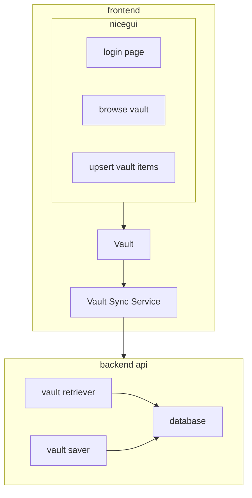

# Loose architecture

We are a 'password manager'. The core data structure for our operation is a Vault that users use to manage passwords. Our backend must handle multiple Vaults.

## Description in English

* things are stored in a Vault
  * Vaults are associated with people (represented by UUIDs)
  * Vaults have an editable username and passcode (i.e. username not tied to UUID.)
  * each Vault has 0..N items (each item is a login, item, or thing. "my gmail account" is an item).
    * each item has 1..N fields.
      * a field is a `key:value` pair of an identifying name and its content (like `email:foo@bar.com`)
        * each value is a string that can be blacked out if it's sensitive information (e.g. passwords)
* vaults are encrypted at rest
  * encrypted with a key, with is identifiable by hashing a user-supplied `Passcode`
    * `Passcode`s are generated via 'stupid ui elements' -- e.g. anything not currently considered to be good for auth
  * encryption/decryption is done within the frontend (e.g. within the browser)
* vaults are saved off to the backend API
  * this may be a REST service, or even just localstorage or the local file system for the MVP

## Pseudocode specification of data structures

This must be the definitive specification. If implementations or other descriptions (like in English, above) differ, they or this should be fixed.

The types designate the data's conceptual type, not real type. For example, the `Backend` could be implemented as a list.

```
dataclass Backend:
  mut data: set[Vault]

dataclass Vault:
  const uuid: uint_128
  mut username: str
  mut passcode: Passcode  # see password_manager/components/passcode_factories/__init__.py
  mut vault_data: list[VaultItem]

dataclass VaultItem:
  mut item_name: str
  mut item_fields: nonempty_list[ItemField]

dataclass ItemField:
  mut key: str
  mut value: Value

dataclass Value:
  mut content: str
  mut hidden: bool  # black out passwords
```

## Diagram of architecture


