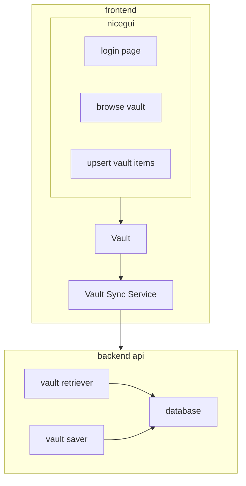

# Loose architecture

We are a 'password manager', wherein:

* things are stored in a Vault
  * each Vault has 0..N items
    * each item has 1..N key:value pairs
      * each value may have a type, e.g. string, password, x509 key, etc.
* vaults are encrypted at rest
  * encrypted with a key
    * keys are generated via 'stupid ui elements' -- e.g. anything not currently considered to be good for auth
  * encryption/decryption is done within the frontend (e.g. within the browser)
* vaults are saved off to the backend API
  * this may be a REST service, or even just localstorage or the local file system for the MVP

